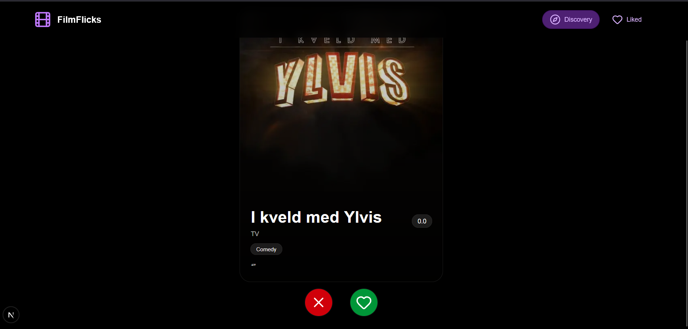
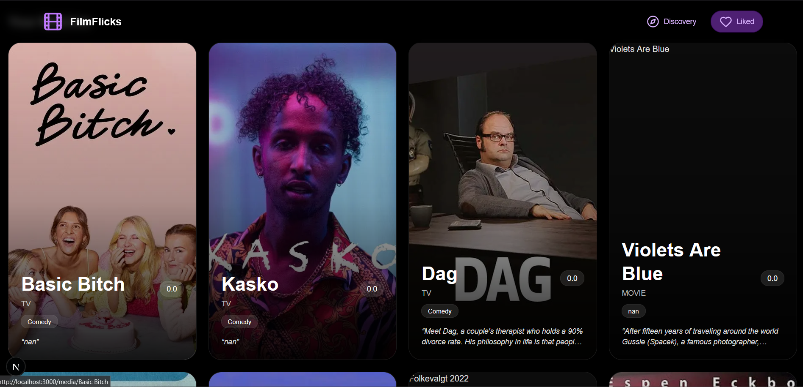

# FilmFlicks – Movie, TV, and Anime Discovery App

FilmFlicks is a swipe-based media discovery web application that helps users find movies, TV shows, and anime tailored to their preferences. Users can like or dislike recommendations, and the system adapts to provide better suggestions over time.

# Features

- Swipe-style Discovery

- Like or dislike media items similar to Tinder-style interaction

- Personalized Recommendations

- Backend recommendation system updates based on user feedback

# Dynamic Content

- Fetches and displays media including:

- Title

- Genres

- Poster images

- Overview/description

# Persistent Feedback

- Likes and dislikes are stored in a database for future recommendations

# Tech Stack

Frontend

    - Next.js

    - TypeScript

    - Tailwind CSS

Backend

    - FastAPI

    - Python

Database

    - SQLite

# Setup Instructions

## 1. Clone the Repository
``` bash
git clone https://github.com/DagmawiDelelegne/FilmFlicks.git
cd  FilmFlicks
```

## 2. Backend Setup
cd backend

- Create virtual environment
python -m venv venv

- Activate (Windows)
venv\Scripts\activate

- Install dependencies
pip install -r requirements.txt

- Run server
uvicorn api_server:app --reload --port 8000

## 3. Frontend Setup
On a separate shell
cd frontend

- Install dependencies
npm install

- Create a .env.local file in the frontend root with the following variable:
NEXT_PUBLIC_BACKEND_URL=http://127.0.0.1:8000

- Start development server
npm run dev

# Demo




# Contributors and Contributions 

FilmFlicks originated as a group project developed by:

- [Dagmawi Delelegne](https://github.com/DagmawiDelelegne)
- [Adrien Baumert](https://github.com/abaumer1)
- [Phillip Henry](https://github.com/phenry3)
- [Abdullah Gill](https://github.com/GillAbdullah)
- [Nate Von Hagen](https://github.com/NateVonHagen)
- [Kamal Korabathina](https://github.com/kkoraba1)

### My Contributions

Features were developed jointly, and no single contributor was solely responsible for the areas listed below.

I was primarily responsible for:

- Implementing user feedback through likes and dislikes
- Integrating the frontend with the backend
- Contributing to the Next.js user interface
- Developing the FastAPI backend and API endpoints